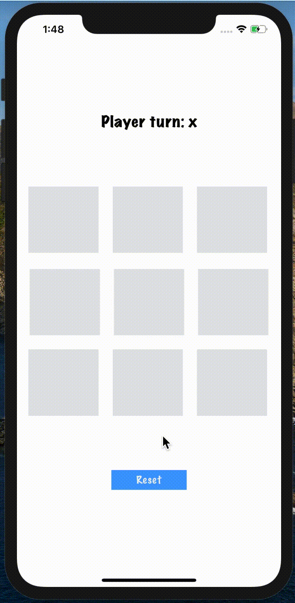

# Tictactoe-swift

## Tictactoe game apps with Swift

Ini adalah salah satu aplikasi yang saya ciptakan saat mengikuti *code challenge* membuat aplikasi game sederhana dengan bahasa pemrograman Swift.

Swift adalah bahasa pemrograman yang didukung oleh Apple untuk membuat aplikasi pada perangkat-perangkat berbasis iOS seperti: iPhone, iPad, Mac, Apple Watch, Apple TV, dan perangkat Apple lainnya.

## Demo

